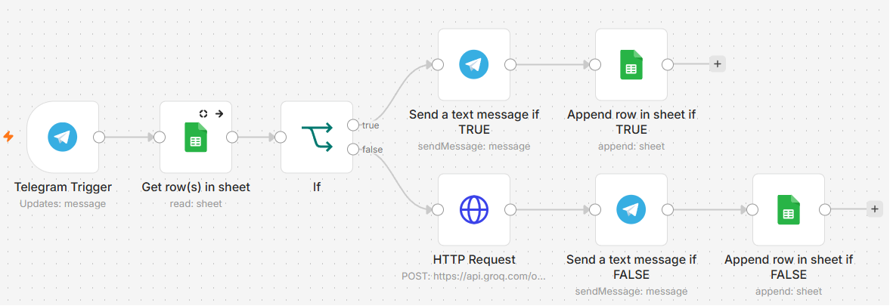

# 🤖 AI-Powered Hybrid Customer Support Bot

Bot Telegram otomatis yang menggabungkan database statis dan AI (LLM) untuk menjawab pertanyaan pelanggan secara cerdas, cepat, dan efisien. Dibangun dengan **n8n workflow automation** dan **100% free-tier services**.

-orange)


---

## 🎯 Masalah yang Diselesaikan

| # | Masalah | Dampak |
|---|---------|--------|
| 1 | **Customer service overload** | Pertanyaan FAQ berulang memakan waktu tim support |
| 2 | **Response time lambat** | Pelanggan menunggu lama untuk jawaban sederhana |
| 3 | **Biaya infrastruktur** | Solusi AI customer service biasanya mahal |
| 4 | **Akurasi vs Fleksibilitas** | Database kaku, tapi AI murni bisa berhalusinasi |

---

## 💡 Solusi: Hybrid Intelligence

Menggabungkan keunggulan database dan AI dalam satu sistem terpadu.

### Prioritas 1 — Database (Google Sheets)
- ✅ Jawaban 100% akurat untuk pertanyaan FAQ
- ✅ Response time < 1 detik
- ✅ Mudah diupdate tanpa coding

### Prioritas 2 — AI Fallback (Groq / Llama 3)
- ✅ Menjawab pertanyaan di luar database
- ✅ Kontekstual dan natural
- ✅ Biaya $0 (Groq free tier)

### Logging & Analytics
- 📌 Semua percakapan tercatat otomatis
- 📌 Tracking sumber jawaban (Database vs AI)
- 📌 Data untuk continuous improvement

---

## 🛠️ Tech Stack (100% Free Tier)

| Komponen | Teknologi | Fungsi |
|----------|-----------|--------|
| **Orchestration** | [n8n](https://n8n.io/) | Workflow automation & integration |
| **Interface** | Telegram Bot API | User interface & messaging |
| **Database** | Google Sheets | FAQ storage & logging |
| **AI/LLM** | [Groq API](https://groq.com/) (Llama 3 70B) | Intelligent fallback responses |
| **Authentication** | OAuth2 & Header Auth | Secure API access |

---

## 📐 Workflow Architecture



### Alur Logika

```
User → Telegram Message
        ↓
   n8n Trigger
        ↓
Search Google Sheets (KnowledgeBase)
        ↓
 ┌──────┴──────┐
 │             │
FOUND       NOT FOUND
 │             │
 ↓             ↓
Kirim       Query Groq AI
Jawaban DB       ↓
 │          Kirim Jawaban AI
 └──────┬───────┘
        ↓
 Log ke Google Sheets
```

---

## ✨ Fitur Utama

### 1. Smart Response Routing
Otomatis memilih sumber jawaban terbaik — prioritas database untuk akurasi, fallback AI untuk fleksibilitas.

### 2. Real-time Logging
Setiap percakapan dicatat lengkap:

| Field | Keterangan |
|-------|------------|
| **Timestamp** | Waktu pertanyaan |
| **User ID** | Identitas penanya |
| **Pertanyaan** | Teks pertanyaan |
| **Jawaban** | Response yang diberikan |
| **Sumber** | Database atau AI Groq |

### 3. Zero-Cost Infrastructure
n8n Cloud · Google Sheets · Groq API · Telegram — semuanya gratis.

### 4. Easy Maintenance
Update FAQ cukup edit Google Sheets. Tidak perlu deploy ulang atau coding sama sekali.

---

## 📂 Struktur File

```
├── workflow.json         # n8n workflow (siap import)
├── README.md             # Dokumentasi proyek
├── workflow-canvas.png   # Screenshot workflow
├── telegram-demo.png     # Demo percakapan
└── sheets-logging.png    # Contoh logging data
```

---

## ⚠️ Status Bot: Tidak Aktif

Bot dibangun menggunakan **n8n Cloud Free Trial** yang memiliki masa aktif 14 hari. Trial telah berakhir, sehingga:

| | Status |
|-|--------|
| Bot membalas pesan otomatis | ❌ Tidak aktif |
| Workflow n8n | ❌ Mode inactive |
| Kode & workflow | ✅ Tetap utuh |
| Import ke n8n lain | ✅ Bisa dilakukan |

---

## 📊 Contoh Penggunaan

**Pertanyaan di Database (Jalur TRUE):**
```
User : jam operasional
Bot  : Kami buka setiap hari Senin–Jumat, pukul 09.00–17.00 WIB.
       [Sumber: Database | Response time: <1s]
```

**Pertanyaan Kompleks (Jalur FALSE — AI):**
```
User : apa itu n8n?
Bot  : N8n adalah platform otomatisasi alur kerja yang memungkinkan
       pengguna menghubungkan berbagai aplikasi dan layanan secara
       visual dan membangun alur kerja kustom...
       [Sumber: AI Groq/Llama 3 | Response time: ~2s]
```

---

## 🔒 Keamanan & Best Practices

- ✅ API Key disimpan di n8n Credentials (terenkripsi)
- ✅ Tidak ada secret yang ter-expose di `workflow.json`
- ✅ GitHub Secret Scanning passed
- ✅ Google Sheets OAuth2 authentication
- ✅ Input sanitization (`toLowerCase` untuk matching)

---

## 📈 Metrik & Hasil

| Metric | Value |
|--------|-------|
| Response Time (DB) | < 1 detik |
| Response Time (AI) | ~ 2 detik |
| Akurasi (DB) | 100% |
| Biaya | $0 (free tier) |
| Waktu Setup | < 30 menit |

---

## 🙏 Acknowledgments

- [n8n](https://n8n.io/) — Workflow automation yang powerful
- [Groq](https://groq.com/) — AI inference superfast
- [Telegram](https://telegram.org/) — Messaging platform yang reliable
- [Google Sheets](https://sheets.google.com/) — Database sederhana yang efektif

---

> ⚡ Dibuat dengan n8n & AI
